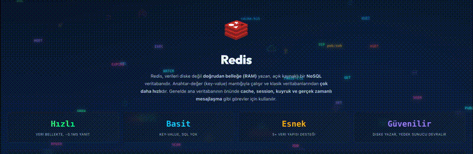
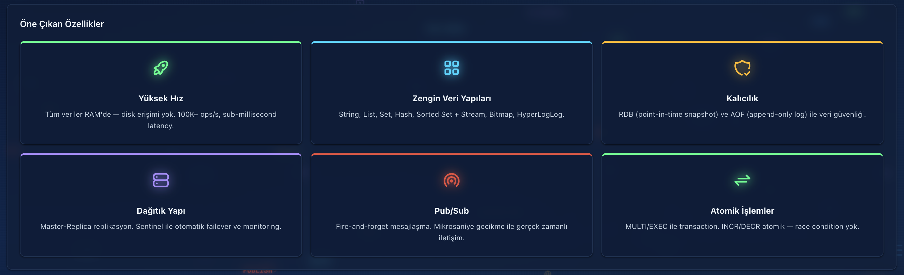
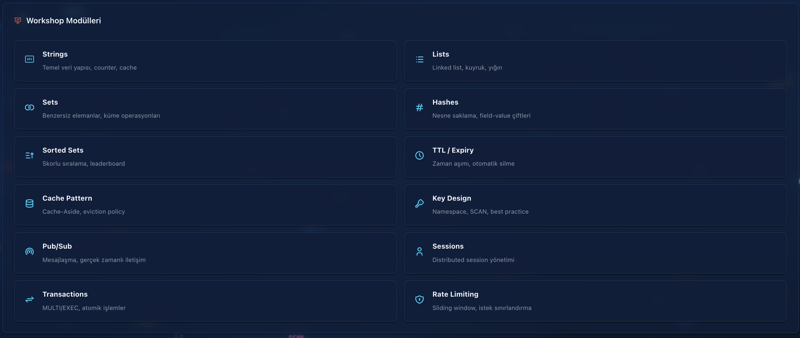
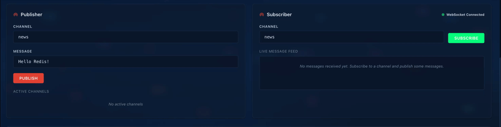
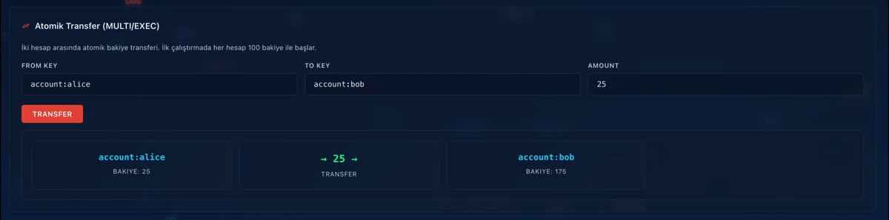
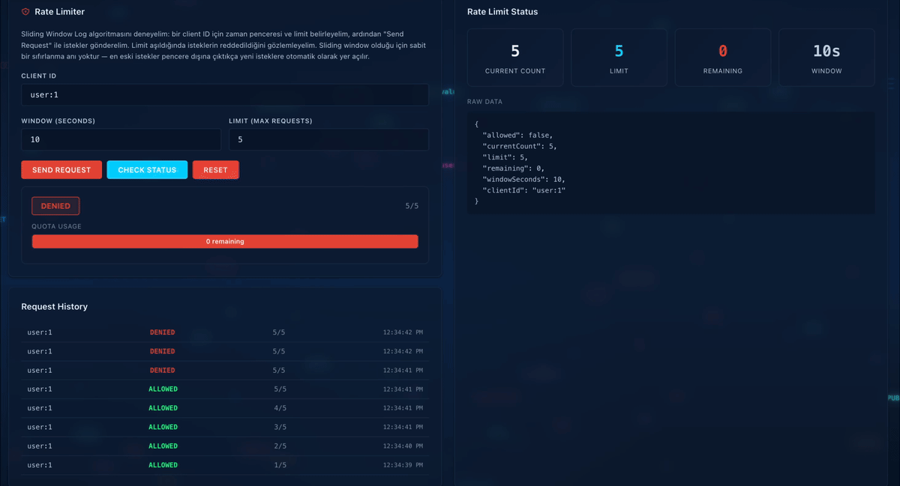
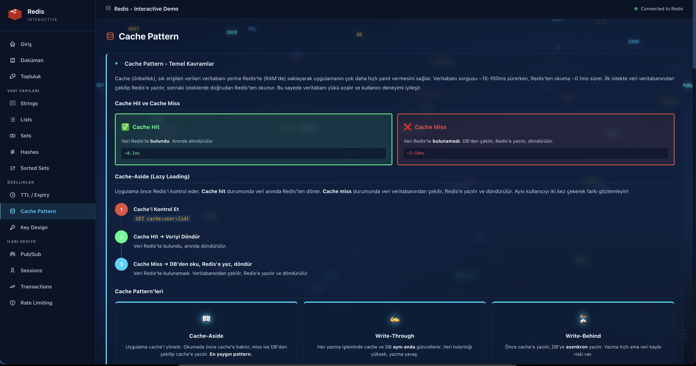
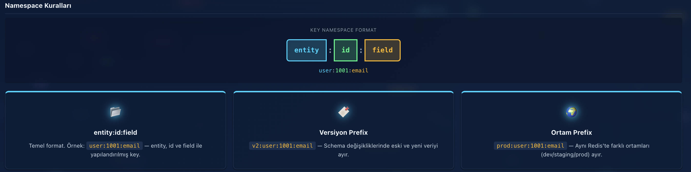
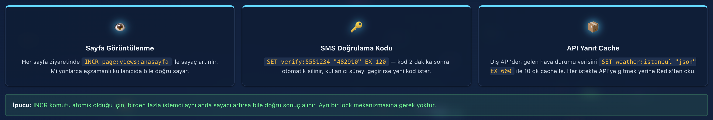

# Redis Workshop


An interactive, full-stack workshop for learning Redis data structures and patterns through hands-on exercises. Covers everything from basic key-value operations to advanced patterns like distributed locks, pub/sub messaging, and rate limiting.



---

## Features

**Core Data Structures**
- Strings, Lists, Sets, Hashes, and Sorted Sets with interactive CRUD operations
- Real-time command logging showing the exact Redis commands executed

**Advanced Patterns**
- Cache-aside pattern with hit/miss statistics
- Distributed locking with acquire/release lifecycle
- Pub/Sub messaging over WebSockets (STOMP + SockJS)
- Rate limiting with sliding window
- Transactions with MULTI/EXEC and optimistic locking via WATCH
- Pipeline benchmarking (batched vs single operations)

**Workshop Experience**
- 14 interactive modules with theory sections and live exercises
- Session management backed by Spring Session + Redis
- Key design best practices with good vs bad examples
- Clean, modern UI with sidebar navigation

---

## Tech Stack

### Backend

| Technology | Purpose |
|---|---|
|  | Language |
|  | Framework |
|  | Redis integration |
|  | Real-time Pub/Sub |
|  | Build tool |

### Frontend

| Technology | Purpose |
|---|---|
|  | UI library |
|  | Build tool |
|  | Routing |
|  | HTTP client |
|  | WebSocket client |

### Infrastructure

| Technology | Purpose |
|---|---|
|  | Data store |
|  | Containerization |
|  | GUI management |

---

## Prerequisites

- **Java 21+**
- **Node.js 18+** and npm
- **Redis 7+** — via Docker (recommended) or installed locally

---

## Getting Started

### 1. Clone the repository

```bash
git clone https://github.com/eilman/Redis-Workshop.git
cd Redis-Workshop
```

### 2. Start Redis

**Option A — Docker (recommended):**

```bash
docker compose up -d
```

This starts Redis 7.4 on port `6379` and RedisInsight on port `5540`.

**Option B — Local Redis:**

```bash
redis-server
```

### 3. Start the backend

```bash
cd redisprojectapi
./gradlew bootRun
```

The API will be available at `http://localhost:8080`.

### 4. Start the frontend

```bash
cd redisprojectweb
npm install
npm run dev
```

The UI will be available at `http://localhost:5173`.

---

## Project Structure

```
Redis-Workshop/
├── redisprojectapi/             # Spring Boot backend
│   └── src/main/java/.../
│       ├── controller/          # REST controllers (14 modules)
│       ├── service/             # Business logic
│       ├── model/               # DTOs and domain objects
│       ├── config/              # Redis, CORS, WebSocket, Session config
│       ├── listener/            # Redis message subscriber
│       └── exception/           # Global error handling
├── redisprojectweb/             # React frontend
│   └── src/
│       ├── components/
│       │   ├── pages/           # Module pages (14 pages)
│       │   ├── common/          # Reusable UI components
│       │   └── Layout/          # Sidebar, TopBar, Layout
│       ├── api/                 # Axios API client
│       └── App.jsx              # Router configuration
├── docker-compose.yml           # Redis + RedisInsight
└── README.md
```

---

## Workshop Modules

| # | Module | Route | Description |
|---|--------|-------|-------------|
| 1 | **Strings** | `/strings` | Basic key-value operations, increment, append |
| 2 | **Lists** | `/lists` | Ordered collections — LPUSH, RPUSH, LPOP, RPOP, LRANGE |
| 3 | **Sets** | `/sets` | Unique member collections, membership checks |
| 4 | **Hashes** | `/hashes` | Field-value maps, partial updates, field increment |
| 5 | **Sorted Sets** | `/sorted-sets` | Scored members, ranking, range queries |
| 6 | **TTL** | `/ttl` | Key expiration, PERSIST, remaining TTL inspection |
| 7 | **Cache Patterns** | `/cache` | Cache-aside with hit/miss stats and invalidation |
| 8 | **Key Design** | `/key-design` | Naming conventions, SCAN, good vs bad patterns |
| 9 | **Pub/Sub** | `/pubsub` | Publish/Subscribe with real-time WebSocket delivery |
| 10 | **Sessions** | `/sessions` | HTTP session storage in Redis via Spring Session |
| 11 | **Transactions** | `/transactions` | MULTI/EXEC, WATCH for optimistic locking |
| 12 | **Rate Limiting** | `/rate-limiting` | Sliding window rate limiter |
| 13 | **Distributed Locks** | — | Acquire/release locks with timeout |
| 14 | **Pipelining** | — | Batch operations vs single-command benchmarks |

---

## API Endpoints

| Resource | Base Path | Key Operations |
|----------|-----------|----------------|
| Strings | `/api/strings` | GET, POST, DELETE, increment, append |
| Lists | `/api/lists` | LPUSH, RPUSH, LPOP, RPOP, LRANGE, LLEN |
| Sets | `/api/sets` | ADD, REMOVE, MEMBERS, ISMEMBER |
| Hashes | `/api/hashes` | SET field, GET field, GET all, DELETE field |
| Sorted Sets | `/api/sortedsets` | ADD, RANGE, RANK, SCORE, DELETE |
| TTL | `/api/ttl` | SET with TTL, GET TTL, EXPIRE, PERSIST |
| Cache | `/api/cache` | Cache-aside read, invalidate, stats, reset |
| Key Design | `/api/keys` | Good/bad examples, SCAN, key info |
| Pub/Sub | `/api/pubsub` | Publish, subscribe, unsubscribe, list channels |
| Sessions | `/api/session` | Login, logout, current session, attributes |
| Transactions | `/api/transactions` | Transfer, MULTI/EXEC, WATCH demo |
| Rate Limiting | `/api/ratelimit` | Check limit, status, reset |
| Locks | `/api/lock` | Acquire, release, status |
| Pipeline | `/api/pipeline` | Benchmark comparison |

> For full endpoint documentation with request/response details, see [`redisprojectapi/README.md`](redisprojectapi/README.md).

---

## Screenshots

### Features Overview


### Workshop Modules


### Pub/Sub — Real-Time Messaging


### Transactions — Atomic Transfer


### Rate Limiting — Sliding Window


### Cache Pattern


### Key Design — Namespace Rules


### Strings — Real-World Use Cases


---

## Environment Variables

| Variable | Default | Description |
|----------|---------|-------------|
| `REDIS_HOST` | `localhost` | Redis server hostname |
| `REDIS_PORT` | `6379` | Redis server port |

---

## Author

Created by **Ekin Ilman** — [GitHub](https://github.com/eilman)

---

## License

This project is licensed under the [MIT License](LICENSE). You are free to use, modify, and distribute this project, provided that the original copyright notice and this permission notice are included.
